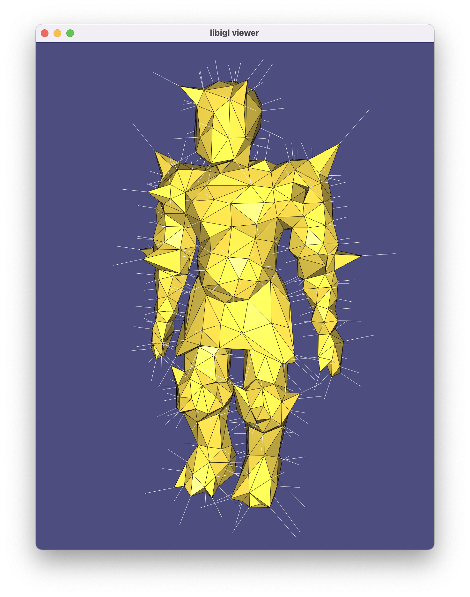

# libigl 🤝 [stan math](https://mc-stan.org/users/interfaces/math)

## Build

stan math will be downloaded upon cmake-ing and will pull in its own boost and
sundial subdependencies and we'll also download tbb.

You can build with the usual

    mkdir build
    cd build
    cmake ../
    make

## Run

From within the `build` directory just issue:

    ./example

A glfw app should launch displaying a knight with white lines indicating the
computed gradients.

## Known Issues

> - Thanks to [cmake/stan.cmake#L57](cmake/stan.cmake#L57) we no longer need to include 
`#include <stan/math.hpp>` before and Eigen or libigl includes.

> - [cmake/stan.cmake](cmake/stan.cmake) is currently using Stan's officially
> supported and included version of tbb. In the past, I tried to fetch tbb
> directly and perhaps there was a version mismatch because Stan was crashing on
> exit in debug mode. This is no longer the case.

